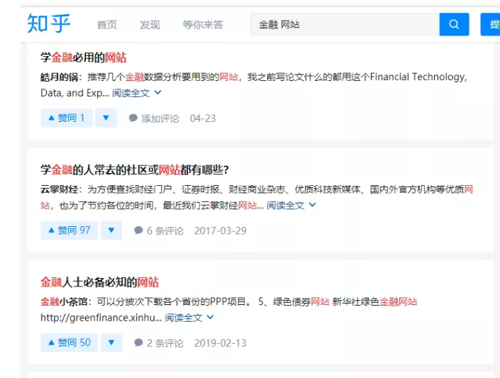
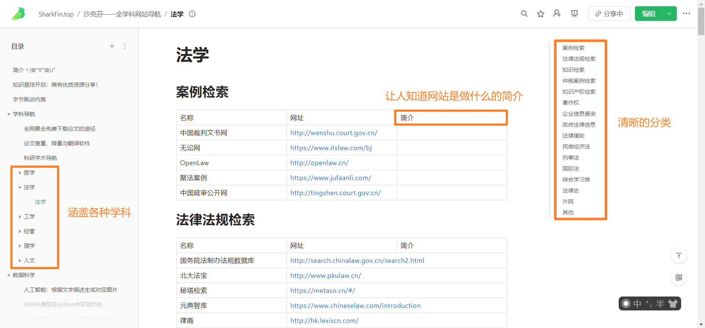

# KnowledgeUnlock

# 简介

KnowledgeUnlock(知识解锁)是一个众人参与的各学科常用网站导航开源项目。

# 使命与价值

让更多学生及工作者更有效率地更精准地获取信息。

# 原因及意义

我是一名商科学生，在日常的学习中，需要上网查找很多专业资料。比如下载研究报告，查找数据等等。一开始我直接百度，发现找到有价值的信息相当困难。后来我又上知乎搜索，发现很多信息都是经筛选后得到的很有价值的。如下图。

这的确给予我很大帮助。但是美中不足的是，

1. **内容重复的。** 这里提的问题和回答很多是重复的
2. **分类不详细。** 我只是知道了很多和金融相关的网站，但是却没有明确的分类，不便于下一次的查找与检索。
3. **可能缺乏介绍。** 我只是知道这个网站，但是不知这个网站到底是做什么的、需要怎么用，可以获取哪些信息。

于是我想，如果可以将这些网站分门别类加以整理，制作成一个 **结构化** 的网站导航，并对每个网站写上简介（备注）。那么下次再使用的时候，直接打开这个网站导航，寻找信息会比之前更加精准和便捷。

以“法学”为例，可以大致这样分类。这样只要直接进入这个导航，便可以清晰快捷地找到自己所需要的信息。

https://www.yuque.com/alipayqgthu1irbf/sharkfin/efn4ho

这里的简介，也可以写的详细一些。或者针对每个学科，有一个文档或视频，专门介绍这些网站都是如何使用的。

# 国际化

以上面的“法学”为例，中国的法学生常用的是上述的网站，那日本的法学生常用的是哪些网站呢？俄罗斯的法学生常用的是哪些网站呢？肯定和中国的法学生常用的网站不一样。

也就是说，不同的国家或地区的使用者常用的网站很可能会不同。他们也有这个需求。

# 内容平台

网站：http://sharkfin.top/ 

语雀：https://www.yuque.com/alipayqgthu1irbf/sharkfin

微信公众号：沙克芬 SharkFin

各平台内容可能有部分差别，推荐在语雀进行阅读。

# 如何参与&加入讨论群

未完待续。

